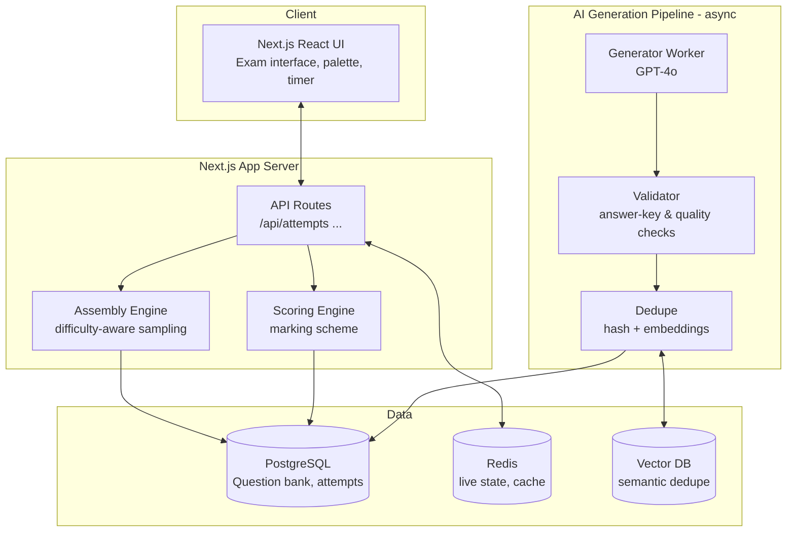
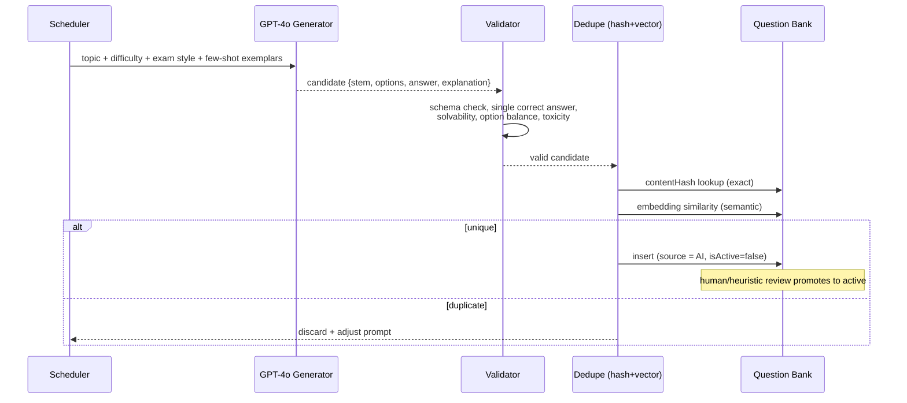

# ExamPrep — AI-Powered Government Exam Simulation Platform

A scalable mock-test platform that reproduces the real exam environment for major
Indian government competitive exams. This repository contains a **working MVP**
(core exam flow) plus the **full target architecture** for building the platform
at scale.

> Currently implemented exams: **SSC CGL Tier 1**, **SSC CHSL Tier 1**,
> **IBPS PO Prelims**, **RRB NTPC CBT 1**, **UPSC Prelims GS Paper 1** — each
> modeled on the official 2026 pattern (section order, question count, timing,
> marking scheme).

---

## 1. What the MVP does today

- **Real exam simulation** — instructions screen → live test with countdown timer,
  section tabs, question palette (answered / not-answered / marked-for-review /
  not-visited), Save & Next, Mark for Review, Clear Response, and a confirmation
  before submit. Auto-submits when time expires. Answers survive page reloads
  (localStorage) and the timer is computed from server `startedAt` so it can't be
  cheated by refreshing.
- **Difficulty selection** — Real / Slightly Harder / 2x Harder / Custom. The
  assembly engine samples questions to match each level's difficulty distribution.
- **Instant result analysis** — score (with negative marking applied), correct /
  wrong / unattempted counts, accuracy, time taken, section-wise table, strength
  & weakness, and a clearing-probability estimate.
- **Detailed explanations** — every question carries a worked explanation shown in
  the result review, filterable by correct / wrong / unattempted.
- **Anti-repetition foundation** — every question has a normalized SHA-256
  `contentHash` with a uniqueness constraint per exam+section, so duplicates are
  rejected at insert time.

The marking engine is exam-accurate. Example (SSC CGL, 21 correct / 79 wrong):
`21 × 2 − 79 × 0.5 = 2.5 / 200`.

---

## 2. Technology stack

| Layer | Choice | Why |
|---|---|---|
| Framework | **Next.js 16 (App Router) + TypeScript** | One codebase for UI + API routes; fast MVP; SSR/edge ready |
| UI | **React 19 + Tailwind CSS** | Rapid, consistent exam UI |
| ORM | **Prisma** | Type-safe data access, migrations, portable schema |
| DB (dev) | **SQLite** | Zero-setup local run |
| DB (prod) | **PostgreSQL** | Concurrency, JSONB, full-text, partitioning at scale |
| Validation | **Zod** | Runtime validation at API boundaries |
| AI (planned) | **OpenAI GPT-4o** | Question generation + doubt clarification |

### Production-scale additions (documented, not in MVP)
- **Redis** — live attempt state, timers, leaderboards, rate-limiting.
- **Vector DB (pgvector / Pinecone)** — semantic de-duplication of questions.
- **Queue (BullMQ / SQS)** — async AI generation & analytics pipelines.
- **Object storage (S3)** — images/diagrams for questions.
- **Auth (NextAuth/Clerk)** — candidate accounts, history, subscriptions.

---

## 3. System architecture



### Request flow (current MVP)
1. `POST /api/attempts` — validates input, calls the **assembly engine** to pick
   questions per the blueprint + difficulty level, persists an `Attempt` with
   `AttemptItem`s, returns `attemptId`.
2. `GET /api/attempts/:id` — returns the paper (stems + options, **no answer
   keys**) plus exam metadata; the client runs the timer/palette.
3. `POST /api/attempts/:id/submit` — evaluates answers against option correctness,
   applies the marking scheme, stores the summary, marks the attempt submitted.
4. `GET /api/attempts/:id/result` — returns full breakdown with correctness,
   explanations and section analytics.

---

## 4. Data model

```mermaid
erDiagram
  Exam ||--o{ Section : has
  Exam ||--o{ Question : "bank (by code)"
  Question ||--o{ Option : has
  Attempt ||--o{ AttemptItem : has
  Question ||--o{ AttemptItem : "instantiated as"

  Exam { string code PK }
  Section { string examCode FK }
  Question { string examCode "string sectionCode" "string difficulty" "string contentHash" }
  Option { string questionId FK "bool isCorrect" }
  Attempt { string examCode "string level" "string status" }
  AttemptItem { string attemptId FK "string questionId" "string selectedOptionId" }
```

Key points:
- **Exam blueprints** live in code ([src/lib/examConfig.ts](src/lib/examConfig.ts))
  and are mirrored into the DB by the seed. They are the single source of truth
  for section order, counts, timing and marking.
- **Question** stores `difficulty`, `topic`, `subject`, `contentHash`, and an
  `isActive` flag. The composite unique `(examCode, sectionCode, contentHash)`
  enforces de-duplication.
- **Attempt / AttemptItem** capture the assembled paper and the candidate's
  responses, so results are fully reproducible.

At scale, partition `Question` by `examCode` and index on
`(examCode, sectionCode, difficulty, topic)`; partition `AttemptItem` by month.

---

## 5. AI question-generation pipeline (target design)



1. **Prompt construction** — per `(exam, section, topic, difficulty)` using
   curated few-shot exemplars and an explicit JSON schema (stem, 4–5 options,
   single correct index, step-by-step explanation).
2. **Validation** — JSON schema, exactly one correct option, math/reasoning
   re-solved programmatically where possible, option plausibility, language &
   safety filters. Invalid items are discarded or repaired.
3. **De-duplication** (the anti-repetition core, see §6).
4. **Staged activation** — AI questions enter as `isActive = false` and are
   promoted after automated + sampled human review, protecting quality.
5. **Continuous expansion** — a scheduler keeps each `(exam, section, topic,
   difficulty)` bucket above a target size so papers rarely reuse items.

The MVP ships deterministic generators for math/reasoning (with genuinely-correct
answers) and curated banks for GK/English in
[src/lib/generators.ts](src/lib/generators.ts); these are the same shapes the AI
worker will emit, so the pipeline plugs in without schema changes.

---

## 6. Anti-repetition strategy

Target: **near-zero repeats** — at most 2–3 of 25 may recur only after many
attempts.

1. **Exact de-dup (implemented)** — normalized SHA-256 `contentHash`
   ([src/lib/hash.ts](src/lib/hash.ts)) with a DB uniqueness constraint;
   identical/trivially-reworded items collapse to one.
2. **Semantic de-dup (planned)** — embed each stem; reject candidates above a
   cosine-similarity threshold against the existing bank (pgvector/Pinecone).
3. **Per-candidate exposure ledger (planned)** — record which question IDs a user
   has seen; the assembly engine excludes recently-seen IDs and only allows reuse
   once the unseen pool for a bucket is exhausted, capped at 2–3 per 25.
4. **Large, growing bank** — the AI scheduler keeps every bucket well above the
   paper size so sampling without replacement is always possible.
5. **Parameterized variants** — numeric templates change values each generation,
   multiplying effective uniqueness for quantitative/reasoning items.

---

## 7. Adaptive testing & analytics (target design)

- **Adaptive difficulty** — after each section (or in a practice mode, each
  question), update an ability estimate (Elo / 2-parameter IRT). Raise difficulty
  on strong streaks; on weak topics, generate targeted remedial sets.
- **Strength/weakness** — per-topic accuracy & time aggregated across attempts
  (the MVP already shows per-section strength/weakness).
- **Rank & clearing probability** — compare the candidate's percentile to a
  modeled cut-off distribution per exam; the MVP ships a transparent heuristic
  that a trained model later replaces.

---

## 8. Admin panel (target design)

- Manual question authoring + bulk CSV import.
- AI-assisted generation with a review/approve queue (promote `isActive`).
- Manage exams, sections, topics, difficulty mixes and marking schemes.
- Platform analytics: attempts, bank coverage per bucket, duplication rate,
  difficulty calibration, candidate funnels.

---

## 9. Scaling to thousands of concurrent candidates

- **Stateless app servers** behind a load balancer; **Redis** holds live attempt
  state and timers.
- **Read replicas** for the question bank; **connection pooling** (PgBouncer).
- **Pre-assembled paper cache** for popular exams to cut start-test latency.
- **Async workers** for AI generation, analytics and result post-processing.
- **CDN** for static assets; **rate-limiting** on attempt/submit endpoints.

---

## 10. Repository map

| Path | Purpose |
|---|---|
| [src/lib/examConfig.ts](src/lib/examConfig.ts) | Exam blueprints (sections, timing, marking, difficulty distributions) |
| [src/lib/assembly.ts](src/lib/assembly.ts) | Difficulty-aware paper assembly with anti-repetition |
| [src/lib/scoring.ts](src/lib/scoring.ts) | Marking-scheme evaluation + section analytics |
| [src/lib/generators.ts](src/lib/generators.ts) | Procedural + curated question generators (AI plug-in point) |
| [src/lib/hash.ts](src/lib/hash.ts) | Content hashing for de-duplication |
| [src/app/api/attempts](src/app/api/attempts) | Start / fetch / submit / result endpoints |
| [src/components/ExamInterface.tsx](src/components/ExamInterface.tsx) | The real-exam test UI |
| [src/components/ResultView.tsx](src/components/ResultView.tsx) | Instant result analysis |
| [prisma/schema.prisma](prisma/schema.prisma) | Database schema (portable SQLite/Postgres) |
| [prisma/seed.ts](prisma/seed.ts) | Seeds exams, sections and the question bank |

See [README.md](README.md) to run it.
